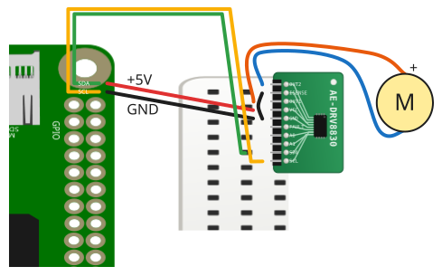

# リモートDCモータードライバ(DRV8830)

## 配線

DRV8830をRasbperryPiとDCモーターに接続します。

| DRV8830 | 接続先       |
| ------- | ------------ |
| OUT2    | DCモーター - |
| ISENSE  | GND          |
| OUT1    | DCモーター + |
| VCC     | 5V           |
| GND     | GND          |
| FAULT   | -            |
| A0      | -            |
| A1      | -            |
| SDA     | SDA          |
| SCL     | SCL          |

ISENSEは電流制限のしきい値を設定する端子です。
このサンプルでは電流制限機能を使わないため、電流検出抵抗を挟まずISENSEをGNDへ直接接続します。

VCCはモーター駆動用の電源も兼ねます。
モーターの消費電流がRaspberry Piの許容量を超える場合は、2.75V〜6.8Vの外部電源をVCCに接続してください。

> [!WARNING]
> Node.js v20 では `WebSocket` が実験的機能としてデフォルト無効のため、Raspberry Pi Zero 側で `node main.js` を実行すると `nodeWebSocketClass and OriginURL are required.` というエラーで終了します。
> `node --experimental-websocket main.js` のようにフラグを付けて実行してください (v22 以降ではフラグ不要です)。

## 遠隔コントローラ(PC/スマホブラウザ)側

[pc/index.html](https://codesandbox.io/s/github/chirimen-oh/chirimen.org/tree/master/pizero/src/esm-examples/remote_drv8830/pc?module=pc.js)を起動します。

スライダーを離したタイミングで電圧(-5V〜5V)をリレーサービスに送信し、Raspberry Pi Zero側でDCモーターを正転・逆転・停止させます。
0を送信すると出力をハイインピーダンス状態にして停止(コースト)します。
